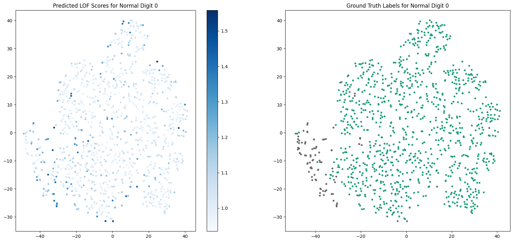

# HW1 - MNIST Anomaly Detection

## Overview

This assignment treats each MNIST digit as the normal class in turn and scores samples from the other nine digits as anomalies. The experiment compares distance-based, clustering-based, covariance-aware, and local-density detectors under one shared protocol.

## Method

- MNIST images are flattened and projected to 30 principal components.
- Ten percent of the training samples are retained for the experiment.
- The evaluation set uses an anomaly ratio of 0.1.
- Normal labels rotate from digit `0` through digit `9`.
- NumPy uses seed `0`.
- ROC-AUC is averaged across the ten normal-class choices.

## Repository contents

- `main.py`: the original experiment with a repository-local MNIST path.
- `images/lof_tsne.png`: the recorded LOF prediction and ground-truth visualization.
- `README.md`: protocol, results, and execution notes.

## Data

Torchvision downloads MNIST to `Homework1_MNIST_Anomaly_Detection/data/` on the first run.

## Execution

From the repository root:

```bash
python -m pip install -r requirements.txt
python Homework1_MNIST_Anomaly_Detection/main.py
```

The full pairwise-distance experiment is computationally intensive.

## Evaluation

Each detector produces an anomaly score for the controlled test mixture. ROC-AUC is computed for every normal-digit choice and averaged across the ten runs.

## Results

| Method | Neighborhood | Average ROC-AUC |
| --- | ---: | ---: |
| k-NN | 1 | 0.9688 |
| k-NN | 5 | 0.9709 |
| k-NN | 10 | 0.9702 |
| k-means distance | 1 | 0.9130 |
| k-means distance | 5 | 0.9246 |
| k-means distance | 10 | 0.9249 |
| Cosine distance | 1 | 0.8846 |
| Cosine distance | 5 | 0.9600 |
| Cosine distance | 10 | **0.9792** |
| Minkowski distance (`r = 1`) | 1 / 5 / 10 | 0.8838 / 0.9331 / 0.9502 |
| Minkowski distance (`r = 2`) | 1 / 5 / 10 | 0.8837 / 0.9345 / 0.9524 |
| Minkowski distance (`r = inf`) | 1 / 5 / 10 | 0.8892 / 0.9381 / 0.9530 |
| Mahalanobis distance | 1 / 5 / 10 | 0.9367 / 0.9709 / 0.9785 |
| Local Outlier Factor | 1 / 5 / 10 | 0.5530 / 0.7924 / 0.8972 |

The strongest recorded average is cosine distance with a neighborhood of 10. Mahalanobis distance is close behind, showing that both angular similarity and covariance-aware distance work well in the PCA feature space.

## Visualization



The plot compares LOF predictions with ground-truth labels in a two-dimensional t-SNE projection.

## Limitations

- PCA is fitted once to the combined training and test images in the original assignment protocol.
- The evaluation distribution is resampled to a fixed anomaly ratio, so the reported values describe that controlled setting.
- Hyperparameters are compared on the same evaluation set and should be read as coursework exploration.

## References

The implementation follows the NTHU CS5658 assignment structure. MNIST is loaded through [`torchvision.datasets.MNIST`](https://docs.pytorch.org/vision/stable/generated/torchvision.datasets.MNIST.html).
