# CS5658 Anomaly Detection Homework2 - TimeSeries AD

## 1. Visualization
- Randomly choose 10 normal / 10 abnormal samples and visualize using line charts.

    ```python!
    normal_data = train_data[train_data[:, 0]==1]
    normal_data = normal_data[np.random.choice(normal_data.shape[0], 10, replace=False), :][:, 1:]

    abnormal_data = train_data[train_data[:, 0]==-1]
    abnormal_data = abnormal_data[np.random.choice(normal_data.shape[0], 10, replace=False), :][:, 1:]
    fig, axs = plt.subplots(2,1,figsize=(10,8))
    for data in normal_data:
      axs[0].plot(np.arange(data.shape[0]), data, c='b')
    for data in abnormal_data:
      axs[1].plot(np.arange(data.shape[0]), data, c='r')
    axs[0].title.set_text("Normal Sample")
    axs[1].title.set_text("Abnormal Sample")
    plt.show()
    ```
-  **Wafer Dataset**
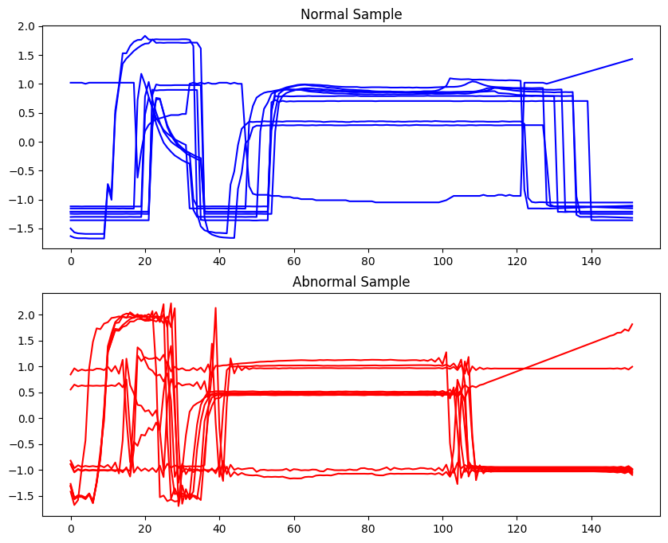
-  **ECG200 Dataset**
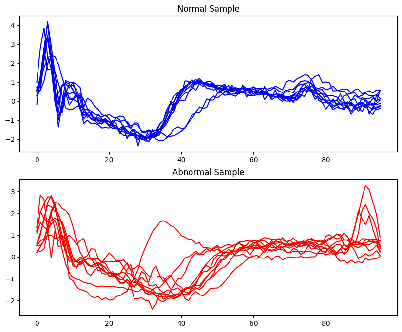


<div style="break-after: page; page-break-after: always;"></div>

## 2. Raw Data

- Implement KNN anomaly detection (K=5) with Euclidean distance and take the average distance among these neighbors as an anomaly score on the raw data and calculate AUC-ROC score of the experiment. 

    ```python!
    def KNN(train_data, train_label, test_data, test_label, k, record):
      # 計算每筆test_data與每筆train_data的Euclidean Distance
      distances = pairwise_distances(test_data, train_data, metric='euclidean')
      # 透過np.sort()升序排列距離後取得前k筆最近的距離，透過np.mean()取平均後得到anomaly score
      anomaly_scores = [np.mean(np.sort(distance)[:k]) for distance in distances]
      # 計算與紀錄auc_score
      auc_score = roc_auc_score(test_label, anomaly_scores)
      pos = record.get(k, 0)
      pos += auc_score
      record[k] = pos
    ```
    ```python!
    # 執行
    for k in k_range:
        KNN(train_data, train_label, test_data, test_label, k, record['KNN'])
    ```
<div style="break-after: page; page-break-after: always;"></div>


## 3. PCA Reconstruction

- This method uses PCA to extract components of the normal samples, and uses N most important components to reconstruct the testing samples. The anomaly score is the reconstruction error (Euclidean distance). You need to try different values of N, and report all the performances of your chosen N. 

    ```python!
    def PCA_reconstruction(train_data, train_label, test_data, test_label, n_components, k, record):
      # 設定PCA
      pca = PCA(n_components)
      # Fit the model with train_data
      pca.fit(train_data)
      # Apply the dimensionality reduction on test_data and reconstruct it.
      proj = pca.inverse_transform(pca.fit_transform(test_data))
      # 計算每筆test_data與每筆reconstruction_data的Euclidean Distance
      distances = pairwise_distances(test_data, proj, metric='euclidean')
      # Apply KNN.
      anomaly_scores = [np.mean(np.sort(distance)[:k]) for distance in distances]
      # 透過anomaly score計算auc_score
      auc_score = roc_auc_score(test_label, anomaly_scores)
      # 紀錄auc_score
      pos = record.get(k, {})
      pos[n_components] = auc_score
      record[k] = pos
    ```
    ```python!
    # Find best n    
    for n in tqdm.tqdm(range(1, min(train_data.shape[0], train_data.shape[1])+1)):
      PCA_reconstruction(train_data, train_label, test_data, test_label, n, 5, record['PCA'])
    best_n = max(record['PCA'][5], key=record['PCA'][5].get)
    # Find best k  
    for k in k_range:
      PCA_reconstruction(train_data, train_label, test_data, test_label, best_n, k, record['PCA'])
    ```

    <div style="break-after: page; page-break-after: always;"></div>


-  Using the best N to visualize the PCA reconstruction result of randomly chosen 10 normal / 10 abnormal samples. 

    ```python!
    # Visualization
    normal_data = train_data[train_data[:, 0]==1]
    normal_data = normal_data[np.random.choice(normal_data.shape[0], 10, replace=False), :][:, 1:]

    abnormal_data = train_data[train_data[:, 0]==-1]
    abnormal_data = abnormal_data[np.random.choice(normal_data.shape[0], 10, replace=False), :][:, 1:]
    
    pca = PCA(n_component)
    proj_normal = pca.inverse_transform(pca.fit_transform(normal_data))
    proj_abnormal = pca.inverse_transform(pca.fit_transform(abnormal_data))

    fig, axs = plt.subplots(2,1,figsize=(10,8))
    for data in proj_normal:
      axs[0].plot(np.arange(data.shape[0]), data, c='b')
    for data in proj_abnormal:
      axs[1].plot(np.arange(data.shape[0]), data, c='r')
    axs[0].title.set_text("Normal Sample")
    axs[1].title.set_text("Abnormal Sample")
    plt.show()
    ```
-  **Wafer Dataset**
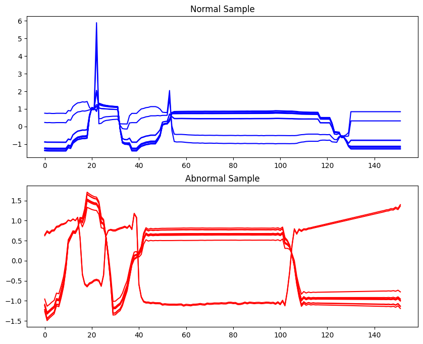
-  **ECG200 Dataset**
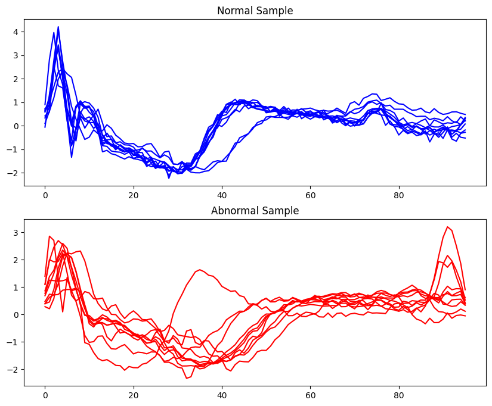


<div style="break-after: page; page-break-after: always;"></div>


## 4. Discrete Fourier Transform

- Implement KNN anomaly detection (K=5) with Euclidean distance and take the average distance among these neighbors as an anomaly score on the selected 1D DFT coefficients and calculate AUC-ROC score of the experiment. The steps are as follows:
    1. First, apply DFT to the target sample (transform to frequency domain).
    2. Second, select the lowest M DFT coefficients for the transformed time series data and concatenate their magnitudes as the DFT feature vector.
    3. Apply KNN anomaly detection with the distance between two time series samples computed as the Euclidean distance between their corresponding DFT feature vectors.
- You need to try different values of M, and report all the performances of your chosen M. 

    ```python!
    def DFT(train_data, train_label, test_data, test_label, M, k, record):
      # 因為低頻coefficients在前後各M/2個，設定 m = M//2
      m = M//2
      # DFT 轉換
      train_dft_coefficients = np.abs(np.fft.fft(train_data, axis=1))
      test_dft_coefficients = np.abs(np.fft.fft(test_data, axis=1))

      # 創建補零後的 DFT 系數矩陣
      train_selected_coefficients = np.zeros_like(train_dft_coefficients)
      test_selected_coefficients = np.zeros_like(test_dft_coefficients)
      # 將 dft_coefficients前後m個的值加入新的矩陣當中
      train_selected_coefficients[:, :m] = train_dft_coefficients[:, :m]
      train_selected_coefficients[:,-m:] = train_dft_coefficients[:,-m:]
      test_selected_coefficients[:, :m] = test_dft_coefficients[:, :m]
      test_selected_coefficients[:,-m:] = test_dft_coefficients[:,-m:]
      # 計算每筆test_data與每筆train_data的Euclidean Distance
      distances = pairwise_distances(test_selected_coefficients, train_selected_coefficients, metric='euclidean')
      # 透過np.sort()升序排列距離後取得前k筆最近的距離，透過np.mean()取平均後得到anomaly score
      anomaly_scores = [np.mean(np.sort(distance)[:k]) for distance in distances]
      # 透過anomaly score計算auc_score
      auc_score = roc_auc_score(test_label, anomaly_scores)
      # 紀錄auc_score
      pos = record.get(k, {})
      pos[M] = auc_score
      record[k] = pos
    ```
    ```python!
    # 執行
    for k in k_range:
      for m in tqdm.tqdm(range(1, train_data.shape[1]+1)):
        DFT(train_data, train_label, test_data, test_label, m, k, record['DFT'])
    ```

    <div style="break-after: page; page-break-after: always;"></div>

- Using the best M to visualize the sequence after selecting lowest M DFT coefficients and applying an inverse DFT for randomly chosen 10 normal / 10 abnormal samples.

    ```python!
    # Visualization
    M = 30 # 30 for Wafer Dataset, for ECG Dataset
    m = M//2
    normal_data = train_data[train_data[:, 0]==1]
    normal_data = normal_data[np.random.choice(normal_data.shape[0], 10, replace=False), :][:, 1:]

    abnormal_data = train_data[train_data[:, 0]==-1]
    abnormal_data = abnormal_data[np.random.choice(normal_data.shape[0], 10, replace=False), :][:, 1:]

    normal_dft_coefficients = np.fft.fft(normal_data)
    abnormal_dft_coefficients = np.fft.fft(abnormal_data, axis=1)

    normal_sorted_indices = np.argsort(np.abs(normal_dft_coefficients), axis=1)
    normal_selected_indices = normal_sorted_indices[:, :M]
    abnormal_sorted_indices = np.argsort(np.abs(abnormal_dft_coefficients), axis=1)
    abnormal_selected_indices = abnormal_sorted_indices[:, :M]

    normal_selected_coefficients = np.zeros_like(normal_dft_coefficients)
    abnormal_selected_coefficients = np.zeros_like(abnormal_dft_coefficients)

    normal_selected_coefficients[:, :m] = normal_dft_coefficients[:, :m]
    normal_selected_coefficients[:,-m:] = normal_dft_coefficients[:,-m:]
    abnormal_selected_coefficients[:, :m] = abnormal_dft_coefficients[:, :m]
    abnormal_selected_coefficients[:,-m:] = abnormal_dft_coefficients[:,-m:]

    inversed_normal = np.fft.ifft(normal_selected_coefficients)
    inversed_abnormal = np.fft.ifft(abnormal_selected_coefficients)

    fig, axs = plt.subplots(2,1,figsize=(10,8))
    for data in inversed_normal:
      axs[0].plot(np.arange(data.shape[0]), data, c='b')
    for data in inversed_abnormal:
      axs[1].plot(np.arange(data.shape[0]), data, c='r')
    axs[0].title.set_text("Normal Sample")
    axs[1].title.set_text("Abnormal Sample")
    plt.show()

    ```


-  **Wafer Dataset**
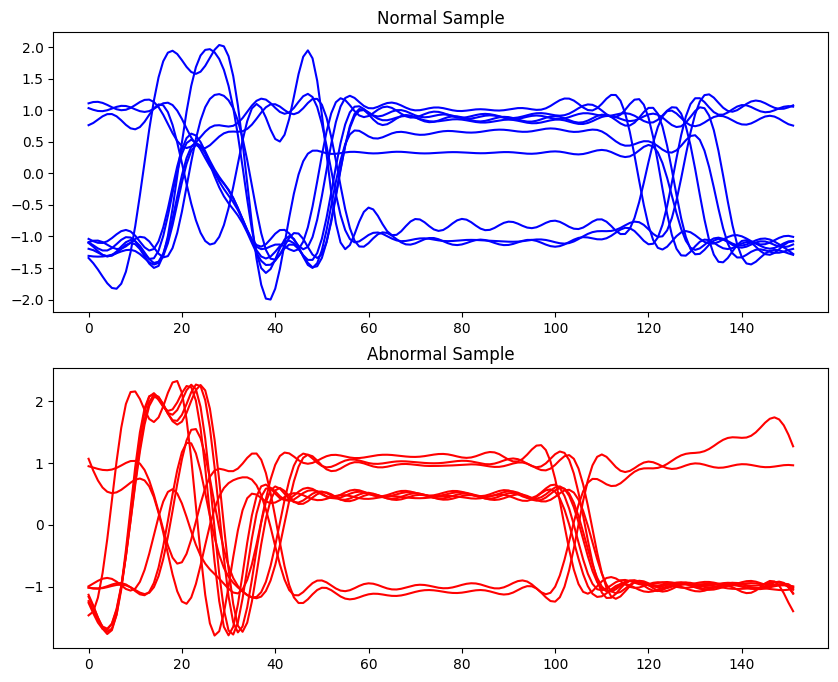

-  **ECG200 Dataset**
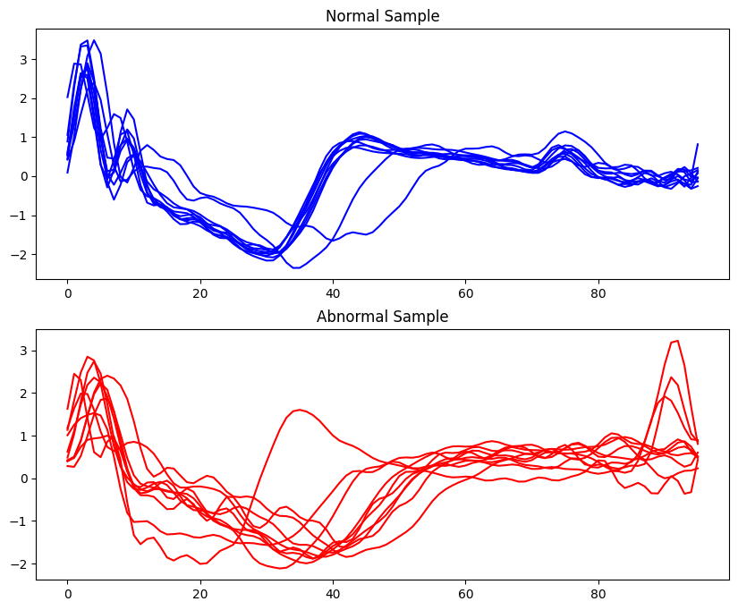


<div style="break-after: page; page-break-after: always;"></div>


## 5. Discrete Wavelet Transform

- Implement KNN anomaly detection (K=5) with Euclidean distance and take the average distance among these neighbors as an anomaly score on the selected Discrete wavelet transform coefficients of the time series data and calculate the AUC-ROC score of the experiment.

    ```python!
    def DWT(train_data, train_label, test_data, test_label, k, record):
      # 實現Haar Wavelet Transform
      def haar_wavelet_transform(data):
        # 獲得data中位於奇數位與偶數位的元素
        even_indices = np.arange(0, data.shape[1], 2)
        odd_indices = np.arange(1, data.shape[1], 2)
        # 依row計算Average與Difference
        a = (data[:, even_indices] + data[:, odd_indices]) / 2
        d = (data[:, even_indices] - data[:, odd_indices]) / 2
        return a, d
      def discrete_wavelet_transform(data):
        # 取得data形狀並進行padding
        feature_dim = data.shape[1]
        padded_dim = int(2 ** np.ceil(np.log2(feature_dim)))

        if padded_dim > feature_dim:
          padded_data = np.pad(data, ((0, 0), (0, padded_dim - feature_dim)), mode='constant')
        # 設定執行輪數
        levels = range(1, int(np.ceil(np.log2(padded_dim))) + 1)
        
        a = padded_data
        transformed = np.zeros((data.shape[0], 0))
        # 每輪在transformed中保存d並讓a繼續計算
        for i in levels:
          a, d = haar_wavelet_transform(a)
          transformed = np.hstack((d, transformed))
        # 將a加入transformed
        transformed = np.hstack((a, transformed))
        return transformed
    
      feature_dim = train_data.shape[1]
      padded_dim = int(2 ** np.ceil(np.log2(feature_dim)))
      levels = range(0, int(np.ceil(np.log2(padded_dim))) + 1)
      # 計算train_data與test_data的DWT
      transformed_train_data = discrete_wavelet_transform(train_data)
      transformed_test_data = discrete_wavelet_transform(test_data)
      # 依照不同S計算AUC score並記錄
      for level in levels:
        S = 2 ** (level) 
        distances = pairwise_distances(transformed_test_data[:, :S], transformed_train_data[:, :S], metric='euclidean')
        anomaly_scores = [np.mean(np.sort(distance)[:k]) for distance in distances]
        auc_score = roc_auc_score(test_label, anomaly_scores)
        pos = record.get(k, {})
        pos = auc_score
        record[k] = pos
    ```
    ```python!
    # 執行
    for k in k_range:
      DWT(train_data, train_label, test_data, test_label, k, record['DWT'])
    ```
<div style="break-after: page; page-break-after: always;"></div>


## 6. Report 

- **Experimetal Results**
  **Performance in Wafer Dataset**
  |         |  k  | parameter |    AUC score |
  | ------- |:---:|:---------:| ------------:|
  | **KNN** |  5  |   ----    |     0.988409 |
  | **PCA** |  5  |   n = 1   |     0.948328 |
  | **DFT** |  5  |  M = 30   |     0.998330 |
  | **DWT** |  5  |   S = 8   | **0.998590** |
  |         |     |           |              |


  **Performance in ECG200 Dataset**
  |         |  k  | parameter |    AUC score |
  | ------- |:---:|:---------:| ------------:|
  | **KNN** |  5  |   ----    |     0.921875 |
  | **PCA** |  5  |   n = 5   |     0.942708 |
  | **DFT** |  5  |  M = 38   |     0.908854 |
  | **DWT** |  5  |  S = 32   | **0.947917** |
  |         |     |           |              |
  
    
* KNN 異常檢測：
    * 在 Wafer Dataset 中，KNN 的表現優異，AUC 分數高達 0.988409，這可能是因為 KNN 能夠很好地捕捉到數據之間的局部關係，並且對於這個特定的數據集效果良好。
    * 在 ECG200 Dataset 中，KNN 的表現較一般，AUC 分數為 0.921875，這可能是因為 ECG200 數據集中的數據分佈較複雜，KNN 難以很好地適應。
    
  
  
<div style="break-after: page; page-break-after: always;"></div>

* PCA 異常檢測：
    * 在 Wafer Dataset 和 ECG200 Dataset 中，PCA 的表現都很不錯，這代表 PCA 很好地捕捉到了數據的特徵。
    * 在k=5時，分別在Wafer Dataset選擇n=1與ECG200 Dataset選擇n=5能達到最好的AUC score。
    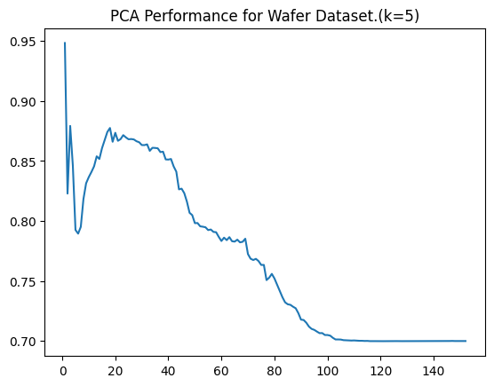
    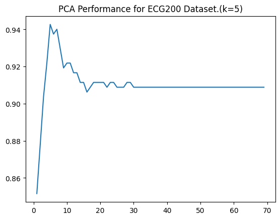

    
  
  
<div style="break-after: page; page-break-after: always;"></div>

* DFT 異常檢測：
    * 在 Wafer Dataset 中，DFT 的AUC 分數為 0.998330，在 ECG200 Dataset 中，DFT 的表現較差，AUC 分數只有 0.908854，可能是因為 DFT 未能很好地捕捉到時間序列的特徵，僅捕捉了時間序列的整體頻率特徵，但忽略了局部特徵。
    * 在k=5時，分別在Wafer Dataset選擇M=30與ECG200 Dataset選擇M=38能達到最好的AUC score。
    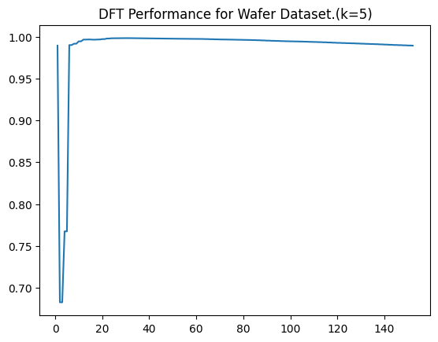
    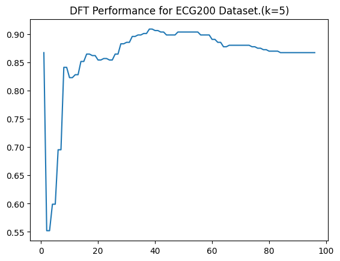

   
    
  
  
<div style="break-after: page; page-break-after: always;"></div>
 
* DWT 異常檢測：
    * 在 Wafer Dataset 和 ECG200 Dataset 中，DWT 的表現都很優異，特別是在 Wafer Dataset 中，AUC 分數達到了 0.998590，這表明 DWT 能夠更好地捕捉到數據的局部特徵和時間頻率特徵，從而取得了出色的表現。
    * 在k=5時，分別在Wafer Dataset選擇S=32與ECG200 Dataset選擇S=8能達到最好的AUC score。
    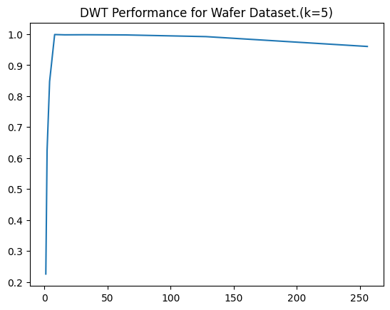
    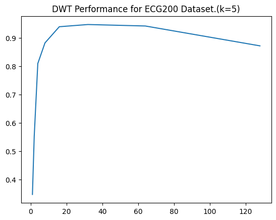


    
        
    
  
  
<div style="break-after: page; page-break-after: always;"></div>


  
## 7. Bonus
- Try different K for all methods and hyperparameters, show best combinations for each method.
- 使用 k in range 1~10 進行實驗

    **Performance in Wafer Dataset**
    |         |  k  | parameter |    AUC score |
    | ------- |:---:|:---------:| ------------:|
    | **KNN** |  1  |   ----    |     0.991350 |
    | **PCA** |  10  |  n = 1   |     0.948331 |
    | **DFT** |  2  |  M = 30  |     0.998467 |
    | **DWT** | 10  |   S = 8   | **0.998673** |
    |         |     |           |              |

    **Performance in ECG200 Dataset**
    |         |  k  | parameter |    AUC score |
    | ------- |:---:|:---------:| ------------:|
    | **KNN** |  2  |   ----    |     0.955729 |
    | **PCA** |  6  |   n = 5   |     0.950521 |
    | **DFT** |  1  |  M = 50   |     0.927083 |
    | **DWT** |  3  |  S = 32   | **0.966146** |
    |         |     |           |              |

  
<div style="break-after: page; page-break-after: always;"></div>


- 各方式詳細結果

    **KNN**

    **Wafer Dataset**
    | k   | AUC score          |
    | --- | ------------------ |
    | 1   | 0.9913499755378608 |
    | 2   | 0.9896026798712533 |
    | 3   | 0.9892442772340458 |
    | 4   | 0.9889150237946889 |
    | 5   | 0.9884085564820364 |
    | 6   | 0.987654652228539  |
    | 7   | 0.9862919272290276 |
    | 8   | 0.9849782258804466 |
    | 9   | 0.9837585969431104 |
    | 10  | 0.9827483122448823 |
    
    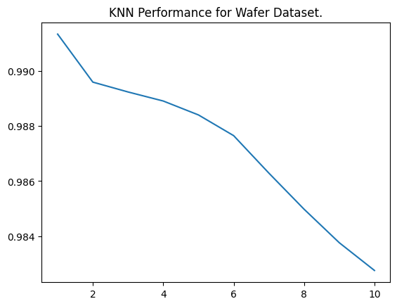
    
    **ECG200 Dataset**
    | k   |          AUC score |
    | --- | ------------------:|
    | 1   | 0.9505208333333334 |
    | 2   | 0.9557291666666666 |
    | 3   | 0.9427083333333334 |
    | 4   |          0.9296875 |
    | 5   |           0.921875 |
    | 6   | 0.9192708333333333 |
    | 7   |            0.90625 |
    | 8   |            0.90625 |
    | 9   | 0.9010416666666666 |
    | 10  | 0.9010416666666666 |
    
    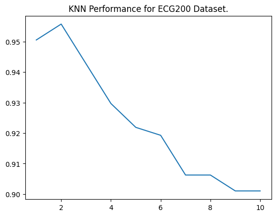

  <div style="break-after: page; page-break-after: always;"></div>


    **PCA**
    **Wafer Dataset**
    | k   | n   |     AUC score      |
    | --- | --- |:------------------:|
    | 1   | 1   | 0.9483274157149287 |
    | 2   | 1   | 0.9483274157149287 |
    | 3   | 1   | 0.9483277469558135 |
    | 4   | 1   | 0.9483280781966982 |
    | 5   | 1   | 0.9483280781966982 |
    | 6   | 1   | 0.9483294031602367 |
    | 7   | 1   | 0.9483297344011214 |
    | 8   | 1   | 0.9483303968828908 |
    | 9   | 1   | 0.9483310593646601 |
    | 10  | 1   | 0.9483313906055448 |
    

  <div style="break-after: page; page-break-after: always;"></div>

    **ECG200 Dataset**
    | k   | n   | AUC score          |
    | --- | --- | ------------------ |
    | 1   | 1   | 0.8515625          |
    | 2   | 8   | 0.9010416666666666 |
    | 3   | 5   | 0.9401041666666666 |
    | 4   | 5   | 0.9375             |
    | 5   | 5   | 0.9427083333333334 |
    | 6   | 5   | 0.9505208333333334 |
    | 7   | 5   | 0.9348958333333334 |
    | 8   | 3   | 0.9375             |
    | 9   | 3   | 0.9296875          |
    | 10  | 3   | 0.9244791666666666 |
    
    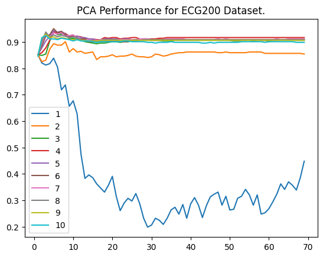


  <div style="break-after: page; page-break-after: always;"></div>


    **DFT**
    **Wafer Dataset**
    | k   | M   |          AUC score |
    | --- | --- | ------------------:|
    | 1   | 30  | 0.9983295522186348 |
    | 2   | 30  | 0.9984666859448862 |
    | 3   | 30  | 0.9984504551415375 |
    | 4   | 30  | 0.9984173310530711 |
    | 5   | 30  | 0.9983765884242574 |
    | 6   | 30  | 0.9983143151379403 |
    | 7   | 30  | 0.9982739037500111 |
    | 8   | 30  | 0.9982149428725409 |
    | 9   | 30  | 0.9981559819950705 |
    | 10  | 30  | 0.9981102707529868 |
    
    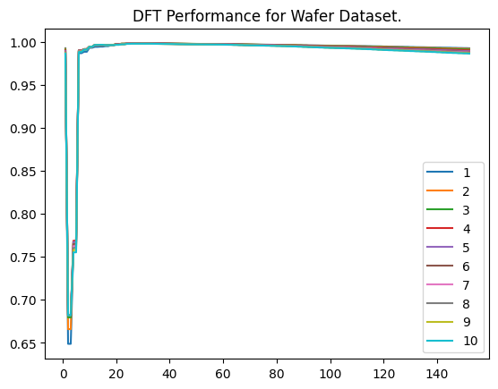

  <div style="break-after: page; page-break-after: always;"></div>

    
    **ECG200 Dataset**
    | k   | M   |          AUC score |
    | --- | --- | ------------------:|
    | 1   | 50  | 0.9270833333333334 |
    | 2   | 38  | 0.9192708333333334 |
    | 3   | 36  |            0.90625 |
    | 4   | 38  |            0.90625 |
    | 5   | 38  | 0.9088541666666667 |
    | 6   | 40  | 0.9088541666666667 |
    | 7   | 38  | 0.9114583333333333 |
    | 8   | 36  | 0.9088541666666667 |
    | 9   | 36  |            0.90625 |
    | 10  | 36  |            0.90625 |
    
    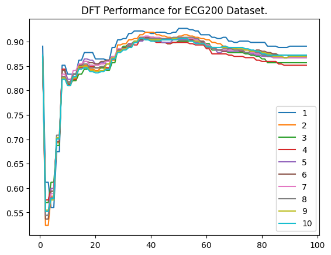


  <div style="break-after: page; page-break-after: always;"></div>


    **DWT**
    **Wafer Dataset**
    | k   | S   |          AUC score |
    | --- | --- | ------------------:|
    | 1   | 32  | 0.9976256653387219 |
    | 2   | 16  | 0.9979459752741929 |
    | 3   | 8   | 0.9983540640441001 |
    | 4   | 8   | 0.9985186907637785 |
    | 5   | 8   | 0.9985899075539815 |
    | 6   | 8   | 0.9986270065330639 |
    | 7   | 8   | 0.9986419123728739 |
    | 8   | 8   | 0.9986548307673758 |
    | 9   | 8   | 0.9986697366071857 |
    | 10  | 8   | 0.9986730490160324 |
    
    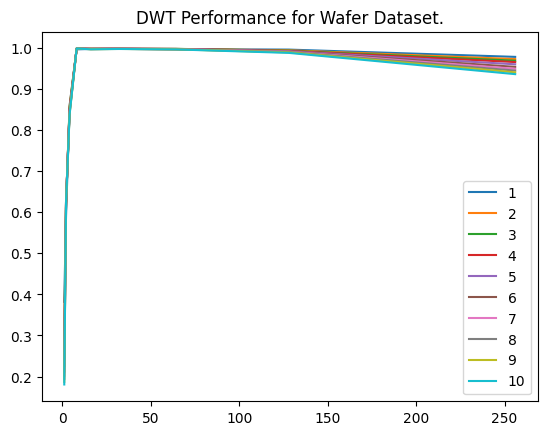

  <div style="break-after: page; page-break-after: always;"></div>


    
    **ECG200 Dataset**
    | k   | S   | AUC score          |
    | --- | --- | ------------------ |
    | 1   | 32  | 0.9635416666666666 |
    | 2   | 32  | 0.9635416666666666 |
    | 3   | 32  | 0.9661458333333334 |
    | 4   | 32  | 0.9583333333333334 |
    | 5   | 32  | 0.9479166666666666 |
    | 6   | 64  | 0.9375             |
    | 7   | 64  | 0.9244791666666667 |
    | 8   | 64  | 0.9114583333333333 |
    | 9   | 64  | 0.90625            |
    | 10  | 32  | 0.90625            |
    
    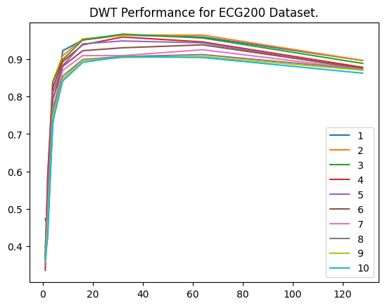

